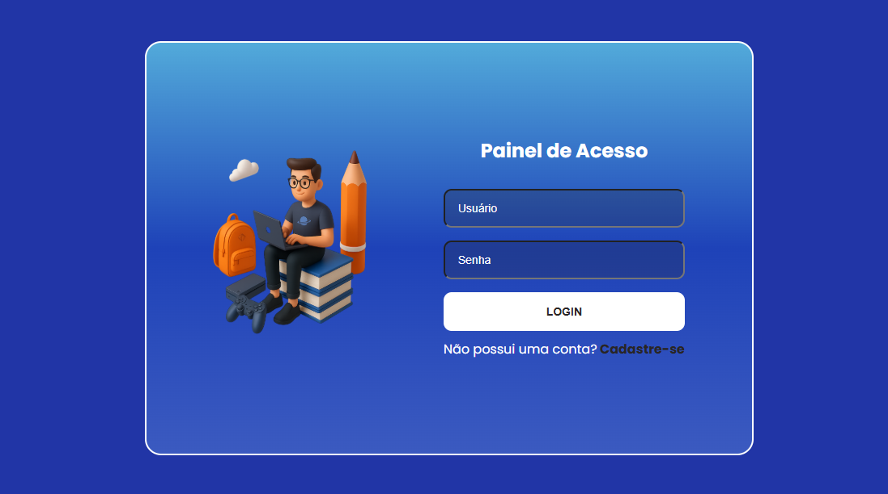
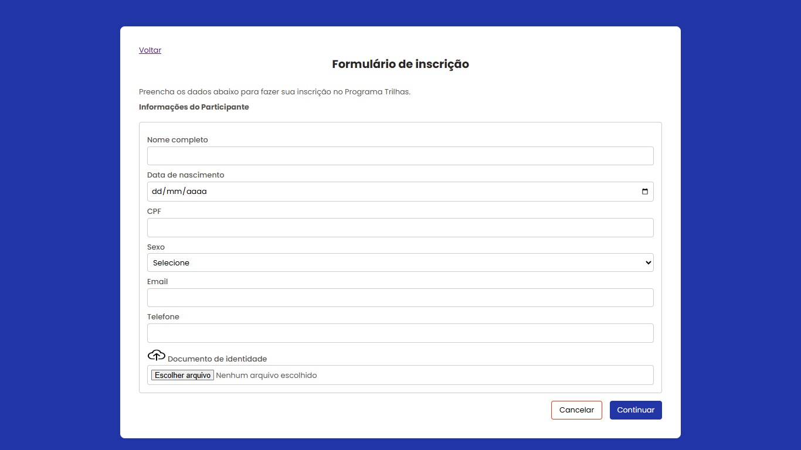
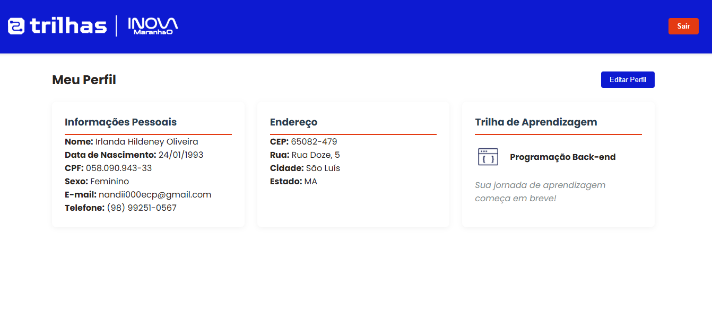

# 👥 Formulário de Inscrição – Programa de Formação Tecnológica

O programa desenvolvido, é um Sistema de Cadastro e Dashboard para a inscrição de candidatos que desejam participar da Formação Tecnologica do "Programa Trilhas" oferecido pelo Governo do Estado do Maranhão.

##  🎯 Objetivo Principal:
Gerenciar a jornada de aprendizes em trilhas de formação tecnológica (Front-end, Back-end, Ciência de Dados, Design e Jogos), desde o cadastro até o acesso à área logada.

## 🔨 Funcionalidades do projeto

O projeto tem como inicio a pagina de login, sendo ela o primeiro contato do candidato. Se ele possui cadastro no sistema, apenas irá fazer login com suas credenciais.

Se nao possuir cadastro, consequentemente ele optará pela oção "Cadastre-se" sendo direcionado para o formulario.

 E após a inserção de todas as informações solicitadas, o mesmo pode efetuar o login e ter acesso a uma Dashboard que irá conter todas as informações cadastradas.

 

## ✨ Funcionalidades Principais:
### 1. Cadastro Completo 
- 4 etapas de formulário com validação
- Coleta dados pessoais, endereço, trilha de interesse e credenciais
- Máscaras para CPF, CEP e telefone
- Busca automática de endereço por CEP (ViaCEP API)

### 1. Sistema de Login
- Autenticação com sessionStorage
- Controle de sessão

### 3.Dashboard 
- Visualização de perfil do usuário
- Exibição dos dados cadastrais
- Informações da trilha escolhida

## ✔️ Técnicas e tecnologias utilizadas

- `HTML`:  A base da aplicação, estruturando os elementos para a interação
do usuário. Onde ele define a interface e organiza os botões, campos e outros
componentes necessários para a dinâmica do sistema.
;
- `CSS`: Fornece feedback visual sempre que um botão é pressionado ou uma
ação é realizada. Ele garante aplicação de estilos dinâmicos conforme necessário;
- `JavaScript`: Será responsável por implementar a lógica da aplicação,
garantindo o funcionamento de eventos e interações que funcionem corretamente.
Ele manipula os elementos HTML e aplica estilos de maneira dinâmica.

- `Armazenamento sessionStorage`: utilizado para o armazenamento temporário dos dados.

## 🛠️ Abrir e rodar o projeto

Para abrir e rodar o projeto, execute o aquivo `login.html` no navegador ou através do live server pelo vscode.

## 📁 Acesso ao projeto

https://devnandii.github.io/Formulario-inscri-es/
obs. Para acessar a page login, clique em cancelar ou voltar.

